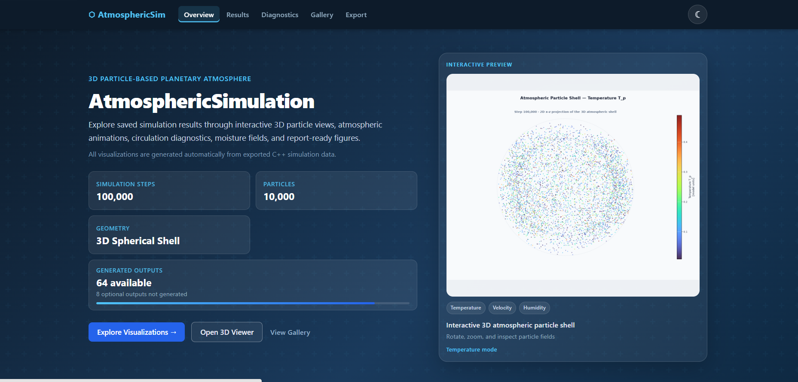

# AtmosphericSimulation

## A 3D Particle-Based Planetary Atmosphere Model

**AtmosphericSimulation** is a C++17 scientific simulation that represents a planetary atmosphere using **10,000 macroscopic Lagrangian air parcels** moving inside a spherical shell.

The project combines:

- Particle-based atmospheric dynamics
- Gravity and short-range parcel repulsion
- Velocity Verlet numerical integration
- Latitude- and altitude-dependent thermal forcing
- Planetary rotation
- Meridional-circulation diagnostics
- Humidity transport, evaporation, condensation, and latent heating
- Automated Python post-processing
- Interactive 3D visualization and scientific plots

> The simulated particles are **macroscopic atmospheric parcels**, not real air molecules.  
> The model is intended as an educational and qualitative atmospheric framework, not as a numerical weather-prediction system.

---

## Table of Contents

- [Project Overview](#project-overview)
- [Main Objectives](#main-objectives)
- [System Architecture](#system-architecture)
- [Physical Model](#physical-model)
- [Numerical Method](#numerical-method)
- [Spatial Grids](#spatial-grids)
- [Thermal Physics](#thermal-physics)
- [Simulation Stages](#simulation-stages)
- [Planetary Rotation](#planetary-rotation)
- [Spherical Coordinates and Diagnostics](#spherical-coordinates-and-diagnostics)
- [Circulation Diagnostics](#circulation-diagnostics)
- [Moisture Model](#moisture-model)
- [Technologies](#technologies)
- [Requirements](#requirements)
- [Quick Start](#quick-start)
- [Running the Visualization Only](#running-the-visualization-only)
- [Opening the Dashboard](#opening-the-dashboard)
- [Generated Outputs](#generated-outputs)
- [Project Structure](#project-structure)
- [Testing and Validation](#testing-and-validation)
- [Engineering Challenges](#engineering-challenges)
- [Future Work](#future-work)
- [Authors](#authors)

---

## Project Overview

Most professional atmospheric models solve continuous fluid equations on a fixed grid. This project explores a different approach: the atmosphere is represented by discrete air parcels that move through a three-dimensional spherical domain.

Each parcel stores its own:

- Position
- Velocity
- Acceleration
- Temperature
- Mass
- Specific humidity

As parcels move, they naturally transport temperature, momentum, and moisture through the domain.

The atmospheric shell is defined by:

```text
R <= |r| <= R + H
```

with:

- Planet radius: `R = 50`
- Atmosphere height: `H = 20`
- Total parcel count: `10,000`
- Time step: `dt = 0.01`
- Production run length: `100,000 steps`

<p align="center">
  
</p>
---

## Main Objectives

The project was designed to:

1. Build a stable 3D parcel simulation inside a spherical shell.
2. Approximate pressure-like behavior using short-range parcel repulsion.
3. Maintain parcel containment using radial boundary correction.
4. Create equator-to-pole and vertical temperature gradients.
5. Add planetary rotation without double-counting rotational effects.
6. Analyze radial, meridional, and zonal velocity components.
7. Generate a streamfunction-like circulation diagnostic.
8. Add humidity transport, evaporation, condensation, latent heating, and water-budget tracking.
9. Produce reusable CSV outputs for scientific analysis.
10. Automate the complete workflow from C++ build to interactive dashboard.

---

## System Architecture

The project uses a layered architecture:

```text
C++ Simulation Engine
        |
        v
Structured CSV Output Contract
        |
        v
Python Post-Processing
        |
        v
Interactive Dashboard and Scientific Exports
```

### 1. C++ Simulation Engine

Responsible for:

- Parcel state
- Force calculation
- Velocity Verlet integration
- Boundary handling
- Thermal forcing
- Rotation
- Moisture processes
- Scientific diagnostics

### 2. Structured Output Contract

The simulation writes step-indexed CSV files containing:

- Cartesian parcel states
- Spherical parcel variables
- Coarse-grid diagnostics
- Temperature profiles
- Circulation accumulation
- Streamfunction-like fields
- Moisture source and sink logs
- Water-balance diagnostics

### 3. Python Post-Processing

Python scripts read the saved simulation data and create:

- Interactive 3D particle views
- Heatmaps and contour plots
- Time-series plots
- Animations
- Report figures
- VTK exports
- Dashboard metadata

### 4. Result Delivery

The generated results are available through a local dashboard containing:

- Interactive HTML figures
- PNG report figures
- GIF animations
- CSV downloads
- VTK files for ParaView

---

## Physical Model

### Atmospheric Representation

The model uses **macroscopic air parcels** rather than real molecules.

Each parcel is treated computationally as a particle with:

```text
r = (x, y, z)      Position
v = (vx, vy, vz)   Velocity
a                  Acceleration
T_p                Parcel temperature
m                  Parcel mass
q_p                Parcel-specific humidity
```

This is a **molecular-dynamics-inspired** representation, but it is not a molecular-scale simulation.

### Newton's Second Law

Parcel motion follows:

```text
m_i * a_i = F_i
```

The continuous mechanical force model is:

```text
F_i = F_g,i + sum(F_rep,ij) + F_damp,i
```

### Short-Range Repulsion

A repulsive force prevents parcels from overlapping:

```text
F_ij = k * (sigma^2 - r_ij^2) * r_hat_ij,  for r_ij < sigma
```

Model parameters:

```text
k       = 200
sigma   = 2
F_max   = 100
```

This force produces a pressure-like excluded-volume effect. It is not a true thermodynamic pressure and is not derived from an ideal-gas equation of state.

### Radial Gravity

Gravity points toward the planet center:

```text
F_grav = -m * g * r_hat
```

with:

```text
g = 0.016
```

Gravity is constant in the current model and does not decrease according to `1/r^2`.

### Initial Damping

During the initial spin-up stage:

```text
F_damp = -gamma * m * (v - Omega x r)
```

The damping suppresses strong initialization transients and is disabled after the shell stabilizes.

### Boundary Conditions

The model has two impermeable radial boundaries:

```text
Inner boundary: r = R
Outer boundary: r = R + H
```

When a parcel crosses a boundary:

1. Its position is projected back to the boundary.
2. Its radial velocity component is reflected.
3. Its tangential velocity is preserved.

This keeps all parcels inside the atmospheric shell.

---

## Numerical Method

The model solves:

```text
dr/dt = v
dv/dt = F/m
```

using the **Velocity Verlet** integrator.

### Velocity Verlet Steps

Half-step velocity:

```text
v^(n+1/2) = v^n + (dt / 2m) * F^n
```

Position update:

```text
r^(n+1) = r^n + dt * v^(n+1/2)
```

After the position update:

- Boundary conditions are applied.
- The fine spatial grid is rebuilt.
- New forces are calculated.

Final velocity:

```text
v^(n+1) = v^(n+1/2) + (dt / 2m) * F^(n+1)
```

Velocity Verlet was selected because it is a second-order method that is well suited to long-running particle simulations.

---

## Spatial Grids

### Fine Grid

The fine grid is used for local neighbor search during repulsive-force calculation.

Instead of checking every parcel pair directly, the 3D domain is divided into cubic cells of size `sigma`.

For each parcel, the algorithm checks:

- Its current cell
- The 26 neighboring cells

This avoids a direct `O(N^2)` all-pairs calculation and makes the 10,000-parcel simulation computationally practical.

### Coarse Grid

The coarse grid calculates local macroscopic quantities:

| Quantity | Meaning |
|---|---|
| `v_mean` | Mean parcel velocity in the cell |
| `T_kinetic` | Local kinetic temperature |
| `T_target` | Local target temperature |
| `q_mean` | Mean humidity |

The coarse grid supports:

- Thermal relaxation
- Humidity mixing
- Large-scale diagnostics
- Scientific plots

It is not used to calculate short-range repulsive forces.

---

## Thermal Physics

The model defines a target temperature field:

```text
T_target(theta, h) = T_base + DeltaT * cos^2(theta) - Gamma * h / H
```

with:

```text
T_base = 1.0
DeltaT = 0.5
Gamma  = 0.2
```

This produces:

- Stronger heating near the equator
- Cooler conditions near the poles
- Cooling with altitude

The model does not include full radiative transfer, a complete day-night cycle, or detailed radiation physics.

### Thermal Collisions

A stochastic relaxation mechanism adjusts parcel thermal velocities toward the local target temperature.

The parcel velocity relative to the local mean flow is:

```text
v_th = v - v_mean
```

A reservoir velocity is sampled from a Maxwell-Boltzmann-like distribution, and the thermal component is partially relaxed:

```text
v_th,new = v_th + alpha * (v_res - v_th)
```

with a relaxation coefficient of approximately:

```text
alpha = 0.2
```

This is a simplified stochastic approximation of heating, cooling, and local energy exchange.

---

## Simulation Stages

| Stage | Approximate Steps | Main Purpose |
|---|---:|---|
| Stage 1 | `0-20,000` | Hydrostatic-like spin-up using gravity, repulsion, and damping |
| Stage 2 | `20,000-40,000` | Thermal forcing with damping disabled |
| Stage 3 | `40,000+` | Planetary rotation and spherical-velocity diagnostics |
| Circulation Analysis | `50,000+` | Late-time accumulation and streamfunction-like analysis |
| Moisture Model | Current implementation: active from initialization | Humidity transport, evaporation, condensation, latent heating, and water accounting |

> Moisture is conceptually presented as Stage 4, but in the current implementation some moisture processes are active from initialization. Making moisture activation fully configurable is a planned improvement.

---

## Planetary Rotation

At the beginning of the rotation stage, rotational velocity is added exactly once:

```text
v <- v + Omega x r
```

For rotation around the `z` axis:

```text
vx <- vx - Omega * y
vy <- vy + Omega * x
```

with:

```text
Omega = 0.01
```

The simulation is evaluated in an inertial frame. Therefore, no explicit artificial Coriolis pseudo-force is added.

Coriolis-like deflection can appear through angular-momentum behavior when parcels move between different latitudes.

---

## Spherical Coordinates and Diagnostics

Cartesian positions and velocities are converted to spherical quantities:

| Quantity | Meaning |
|---|---|
| `r` | Distance from the planet center |
| `h = r - R` | Altitude above the planet surface |
| `theta` | Latitude |
| `phi` | Longitude |
| `v_r` | Radial velocity: upward or downward motion |
| `v_theta` | Meridional velocity: north-south motion |
| `v_phi` | Zonal velocity: east-west motion |

Interpretation:

```text
v_r > 0   Upward motion
v_r < 0   Downward motion
```

`v_theta` is the main velocity component used for meridional-circulation analysis.

---

## Circulation Diagnostics

A single particle snapshot is noisy, so circulation data is accumulated over a late-time interval on a:

```text
36 latitude bins x 20 altitude bins
```

grid.

A particle-count-weighted meridional-flow proxy is calculated:

```text
Phi_proxy = N_cell * mean(v_theta)
```

where particle count is used as a density proxy.

The streamfunction-like diagnostic is calculated by vertical accumulation:

```text
Psi[k] = Psi[k - 1] + Phi[k] * delta_h
```

Positive and negative regions indicate opposite directions in the diagnostic circulation field.

The results show organized meridional transport, but the project does **not** claim conclusive identification of the classical Hadley, Ferrel, and Polar cells.

---

## Moisture Model

Each parcel carries specific humidity:

```text
q_p
```

### Humidity Initialization

Higher humidity is initialized near the surface. Humidity decreases with altitude.

### Saturation Humidity

The model estimates local saturation humidity using temperature and altitude-dependent pressure.

Model temperature is mapped to Kelvin:

```text
T_K = 300 + 50 * (T_model - 1)
```

Pressure decreases exponentially with altitude:

```text
p(h) = p_0 * exp(-h / H_s)
```

Saturation vapor pressure is calculated using a standard meteorological approximation, and saturation humidity is derived from it.

### Humidity Mixing

Parcel humidity is relaxed toward the local coarse-grid mean:

```text
q_p <- q_p + alpha_q * (q_mean - q_p)
```

### Evaporation

Evaporation is applied near the surface when the parcel is below saturation:

```text
Delta_q_evap = k_evap * (q_sat - q_p) * dt
```

The current model treats the lower atmospheric layer as a generic moisture source and does not distinguish between ocean, land, soil, or topography.

### Condensation

Condensation occurs when:

```text
q_p > q_sat
```

The excess vapor is removed from the parcel. Numerical caps are used for stability.

The model does not create liquid droplets, separate cloud particles, rain, or snow.

### Latent Heating

Condensation increases parcel temperature:

```text
T_p <- T_p + L_model * Delta_q
```

The latent-heat coefficient is calibrated in model units.

### Water Balance

The expected total humidity is:

```text
q_expected = q_initial + E_cumulative - C_cumulative
```

The diagnostic compares the expected value with the actual sum of parcel humidity.

This helps detect unaccounted moisture sources, sinks, numerical clamping, or non-conservative mixing effects.

---

## Technologies

### Core Simulation

- C++17
- CMake
- Standard Library

### Numerical and Scientific Methods

- Velocity Verlet
- 3D spatial hashing
- Coarse-grid aggregation
- Spherical-coordinate analysis
- Time-accumulated circulation diagnostics

### Visualization

- Python
- Pandas
- NumPy
- Matplotlib
- Plotly
- ImageIO

### Development Environment

- Windows
- WSL Ubuntu
- VS Code / Cursor
- Git
- GitHub

### Export Formats

- CSV
- HTML
- PNG
- GIF
- VTK

---

## Requirements

### C++ Build Requirements

- A C++17-compatible compiler
- CMake
- Make or Ninja

Example Ubuntu/WSL installation:

```bash
sudo apt update
sudo apt install -y build-essential cmake python3 python3-venv python3-pip
```

### Python Requirements

Create and activate a virtual environment:

```bash
python3 -m venv viz_env
source viz_env/bin/activate
```

Install visualization dependencies:

```bash
pip install -r visualization/requirements.txt
```

---

## Quick Start

Clone the repository:

```bash
git clone https://github.com/Yasser-Saadi-7/Atmospheric-Particle-Motion-Simulation-3D-Environmental-Modeling.git
cd Atmospheric-Particle-Motion-Simulation-3D-Environmental-Modeling
```

Create the Python environment:

```bash
python3 -m venv viz_env
source viz_env/bin/activate
pip install -r visualization/requirements.txt
```

Make the pipeline executable:

```bash
chmod +x run_full_pipeline.sh
```

Run the complete workflow:

```bash
./run_full_pipeline.sh
```

The pipeline:

1. Configures the CMake project.
2. Builds the C++ simulation in Release mode.
3. Cleans old generated simulation outputs.
4. Runs the 10,000-parcel production model.
5. Verifies that current-run CSV files were generated.
6. Rebuilds figures, interactive HTML views, animations, VTK files, and dashboard metadata.
7. Verifies the generated dashboard assets.

---

## Running the Visualization Only

When simulation CSV files already exist in `build/output`, regenerate the visual outputs without running the C++ simulation:

```bash
source viz_env/bin/activate
./run_full_pipeline.sh --visualization-only
```

You can also invoke the dashboard builder directly:

```bash
python3 visualization/build_dashboard.py \
  --input build/output \
  --out visualization_output \
  --max-particles 5000 \
  --verbose
```

`--max-particles` affects only browser rendering. It does not change the full 10,000-parcel simulation data.

---

## Opening the Dashboard

Start a local HTTP server:

```bash
cd visualization_output
python3 -m http.server 8000
```

Open:

```text
http://localhost:8000/
```

From WSL on Windows:

```bash
explorer.exe http://localhost:8000/
```

A local server is recommended because some browsers restrict JavaScript and local-file access when opening `index.html` directly.

---

## Generated Outputs

### Simulation Data

The main simulation outputs are written under:

```text
build/output/
```

Representative files include:

```text
particles_step_*.csv
particle_spherical_step_*.csv
coarse_grid_step_*.csv
circulation_accum_step_*.csv
streamfunction_step_*.csv
temperature_zones.csv
altitude_temperature_profile.csv
simulation_log.csv
evaporation_log.csv
condensation_log.csv
moisture_balance.csv
```

### Visualization Data

Generated visualization files are written under:

```text
visualization_output/
```

Representative folders include:

```text
visualization_output/html/
visualization_output/png/
visualization_output/animations/
visualization_output/report_figures/
visualization_output/vtk/
visualization_output/summary/
visualization_output/validation/
```

The dashboard uses:

```text
visualization_output/index.html
visualization_output/assets/style.css
visualization_output/assets/dashboard.js
visualization_output/assets/generated_manifest.js
```

---

## Project Structure

```text
AtmosphericSimulation/
├── CMakeLists.txt
├── run_full_pipeline.sh
├── build/
│   └── output/
├── visualization/
│   ├── build_dashboard.py
│   ├── data_loader.py
│   ├── plot_particles_3d.py
│   ├── plot_heatmaps.py
│   ├── plot_timeseries.py
│   ├── plot_moisture.py
│   ├── animation_builder.py
│   ├── manifest_builder.py
│   └── requirements.txt
├── visualization_output/
│   ├── index.html
│   ├── assets/
│   ├── html/
│   ├── png/
│   ├── animations/
│   ├── report_figures/
│   ├── vtk/
│   └── validation/
└── README.md
```

The exact generated folders may vary depending on the selected pipeline options.

---

## Testing and Validation

The project evaluates several areas.

### Build and Execution

- Release-mode compilation
- Full 100,000-step execution
- Fresh CSV generation

### Geometry and Containment

- Minimum and maximum parcel radius
- Out-of-shell parcel count
- Boundary-reflection behavior

### Numerical Stability

- Finite values
- No uncontrolled `NaN` or `Infinity`
- Energy and velocity diagnostics
- Long-run stability

### Thermal Behavior

- Equator-to-pole temperature comparison
- Temperature variation with altitude
- Radial-velocity diagnostics

### Rotation

- Single `Omega x r` velocity imprint
- Spherical velocity components
- No repeated rotational acceleration

### Circulation

- Finite `v_theta`
- Particle-count-weighted meridional-flow proxy
- Finite streamfunction-like `Psi`
- Late-time accumulated diagnostics

### Moisture

- Bounded and finite `q_p`
- Evaporation and condensation logs
- Latent-heating diagnostics
- Water-budget comparison

### Visualization

- Dashboard regeneration
- HTML and image loading
- Animation generation
- Manifest consistency
- Data-driven color scaling

---

## Engineering Challenges

### Particle Containment

**Challenge:** Parcels could leave the spherical shell.

**Solution:** Radial projection and reflection of only the radial velocity component.

### Computational Cost

**Challenge:** Direct pairwise force calculation requires `O(N^2)` work.

**Solution:** A 3D cell list checks only the current cell and its 26 neighbors.

### Initialization Instability

**Challenge:** Random initial conditions created strong early transients.

**Solution:** Strong damping during spin-up, followed by permanent deactivation.

### Rotation Modeling

**Challenge:** Add planetary rotation without double-counting.

**Solution:** Apply `Omega x r` exactly once at the stage transition.

### Noisy Circulation Data

**Challenge:** Single particle snapshots were too noisy.

**Solution:** Accumulate velocity and particle-count data over a late-time interval before calculating `Psi`.

### Visualization Performance

**Challenge:** Rendering every parcel reduced browser performance.

**Solution:** Use visualization-only downsampling and data-driven color ranges.

### Reproducibility

**Challenge:** Old output files could contaminate new results.

**Solution:** Use a clean-run pipeline with output freshness checks.

---

## Future Work

Planned or recommended improvements include:

- Configurable moisture activation stage
- Physical density weighting for circulation analysis
- A more rigorous mass streamfunction
- Additional automated CSV schema and freshness tests
- Checkpoint and restart support
- Parameter sweeps and ensemble runs
- Improved VTK and ParaView export validation
- Better unit calibration
- Surface heat, moisture, and momentum exchange
- Land, ocean, and topography models
- Cloud and precipitation microphysics
- Stronger scientific comparison with reference atmospheric models

---

## Representative Results

The project generates:

- A stable 3D particle shell
- Latitude- and altitude-dependent temperature diagnostics
- Radial, meridional, and zonal velocity fields
- Streamfunction-like meridional-circulation maps
- Interactive 3D parcel viewers
- Moisture time series and water-budget panels
- Report-ready PNG figures
- VTK exports for ParaView

The current circulation results show organized positive and negative structures in the diagnostic field. These results are interpreted as evidence of structured meridional transport, not as definitive proof of the classical atmospheric three-cell circulation.

<!--
Add screenshots to the repository and uncomment these examples:


-->

---

## Reproducibility Notes

For trustworthy results:

1. Use the clean full pipeline for production runs.
2. Do not mix files from different simulation runs.
3. Confirm that `build/output` contains fresh CSV files.
4. Regenerate the dashboard after every new simulation run.
5. Keep simulation outputs and browser-downsampled visualizations conceptually separate.
6. Record the Git commit used for final scientific results.

---

## Authors

**Team 26-1-R-13**

- Yasser Sadi
- Diana Hujerat

**Advisor:** Dr. Zakharia Frenkel

Software Engineering Department  
Capstone Project — Phase B

---

## Academic Notice

This repository contains an academic capstone project. The model is intended for educational and research-oriented experimentation. It should not be used for operational weather forecasting or safety-critical environmental decisions.
